<h3>Category</h3>
<ul>
    <li> after_dinner</li>
    <li> buck</li>
    <li> campari</li>
    <li> champagne</li>
    <li> cobbler</li>
    <li> cocktail</li>
    <li> coffee</li>
    <li> collins</li>
    <li> crusta</li>
    <li> daisy</li>
    <li> eggnog</li>
    <li> fizz</li>
    <li> flip</li>
    <li> frappe_swizzle</li>
    <li> grog</li>
    <li> highball</li>
    <li> julep</li>
    <li> martini</li>
    <li> mocktail</li>
    <li>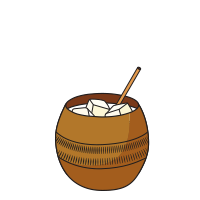 mule</li>
    <li> punch</li>
    <li> smash</li>
    <li> smoked</li>
    <li> sour</li>
    <li> spritz</li>
    <li> tiki</li>
    <li> toddy</li>
</ul>
<h3>Ingredients</h3>
<ul>
    <li>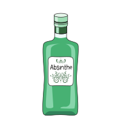 absinthe</li>
    <li>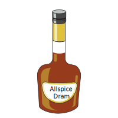 allspice-dram</li>
    <li> amaretto</li>
    <li> amaro</li>
    <li> aperol</li>
    <li>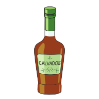 apple-brandy</li>
    <li> apricot-liqueur</li>
    <li> banana</li>
    <li> benedictine</li>
    <li> bitters</li>
    <li>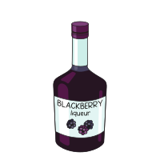 blackberry</li>
    <li>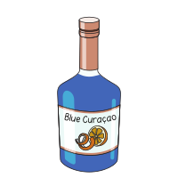 blue-curacao</li>
    <li> bourbon</li>
    <li> brandy</li>
    <li> cacao</li>
    <li> cachaca</li>
    <li> calvados</li>
    <li> campari</li>
    <li> champagne</li>
    <li> chartreuse</li>
    <li>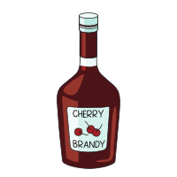 cherry</li>
    <li>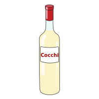 cocchi-americano</li>
    <li>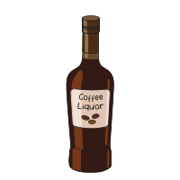 coffee-liqueur</li>
    <li> cognac</li>
    <li> cream-of-cocunut</li>
    <li> cream</li>
    <li> creme_de_cacao</li>
    <li> creme-de-casis</li>
    <li>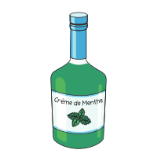 creme-de-menthe</li>
    <li> creme_de_menthe</li>
    <li> creme-de-violette</li>
    <li> curacao</li>
    <li> dark-rum</li>
    <li> drambuie</li>
    <li> dry-vermouth</li>
    <li> dubonnet-rouge</li>
    <li> egg-white</li>
    <li> elderflower-liqueur</li>
    <li> falernum</li>
    <li> genever</li>
    <li>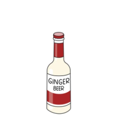 ginger-beer</li>
    <li>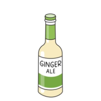 ginger-soda</li>
    <li>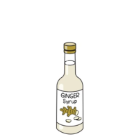 ginger-syrup</li> 
    <li> gin</li>
    <li>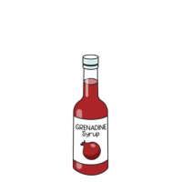 grenadine</li>
    <li> irish-whiskey</li>
    <li> jamacian-rum</li>
    <li>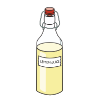 lemon-juice</li>
    <li> light-rum</li>
    <li> lillet-blanc</li>
    <li> lillet-rouge</li>
    <li>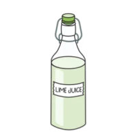 lime-juice</li>
    <li> maple-syrup</li>
    <li> maraschino-liqueur</li>
    <li> mezcal</li>
    <li> milk</li>
    <li> orange-bitters</li>
    <li>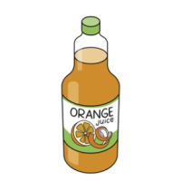 orange-juice</li>
    <li> orange</li>
    <li> orgeat-syrup</li>
    <li> passion-fruit-syrup</li>
    <li> peach</li>
    <li> pineapple-juice</li>
    <li> pisco</li>
    <li>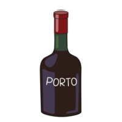 port</li>
    <li> prosecco</li>
    <li> red-wine</li>
    <li> reposado-tequila</li>
    <li> rye</li>
    <li> scotch</li>
    <li> sherry</li>
    <li>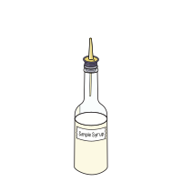 simple-syrup</li>
    <li> single-malt-scotch</li>
    <li> soda-water</li>
    <li> sugar</li>
    <li> sweet-vermouth</li>
    <li> tequila</li>
    <li> tonic-water</li>
    <li> triple-sec</li>
    <li> vermouth</li>
    <li>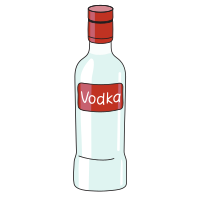 vodka</li>
    <li> water</li>
    <li> whiskey</li>
    <li> white-wine</li>
</ul>
<h3>Twists</h3>
<ul>
<li> cocktail-cherry</li>
<li> lemon</li>
<li> lemon_cherry</li>
<li> orange</li>
</ul>
<h3>Tools</h3>
<ul>
<li>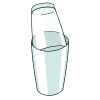 boston-shaker</li>
<li>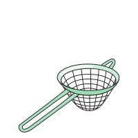 double-strainer</li>
<li>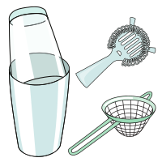 double_strain</li>
<li> grater</li>
<li> hawthorn-strainer</li>
<li> julep-strainer</li>
<li> long-stirrer</li>
<li> mixing-glass</li>
<li> muddler</li>
<li> peeler</li>
<li> shaker</li>
<li> squeezer</li>
<li> stirred</li>
</ul>
<h3>Spices</h3>
<ul>
<li>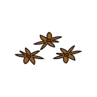 anise</li>
<li> coffee</li>
<li> cinnamon</li>
</ul>
<h3>Slice</h3>
<ul>
<li> green_apple</li>
<li> pineapple</li>
<li> lime</li>
</ul>
<h3>Glasses</h3>
<ul>
<li> cobbler</li>
<li> coffee</li>
<li>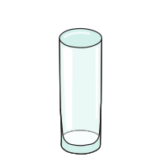 collins</li>
<li> copper-mug</li>
<li> cordial</li>
<li> coupe</li>
<li> double-old-fashioned</li>
<li> flute</li>
<li> gin-balloon</li>
<li>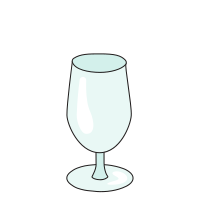 goblet</li>
<li> highball</li>
<li> hurricane</li>
<li> julep-cup</li>
<li> margarita</li>
<li> martini</li>
<li> nick-and-nora</li>
<li> old-fashioned</li>
<li>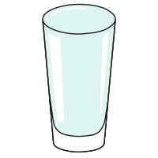 pint</li>
<li> rocks</li>
<li> sling</li>
<li> snifter</li>
<li> sour</li>
<li>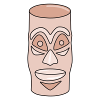 tiki</li>
<li> whiskey</li>
</ul>
<h3>Ice cubes</h3>
<ul>
<li> cubes</li>
<li> large</li>
</ul>
<h3>Herbs</h3>
<ul>
<li> mint</li>
<li> thyme</li>
</ul>
